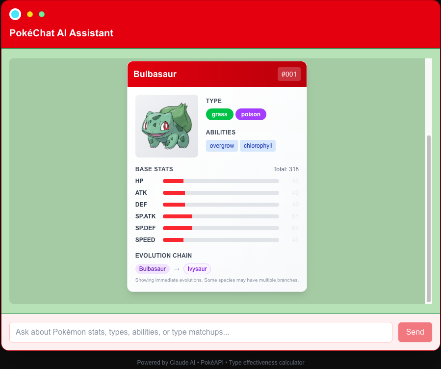
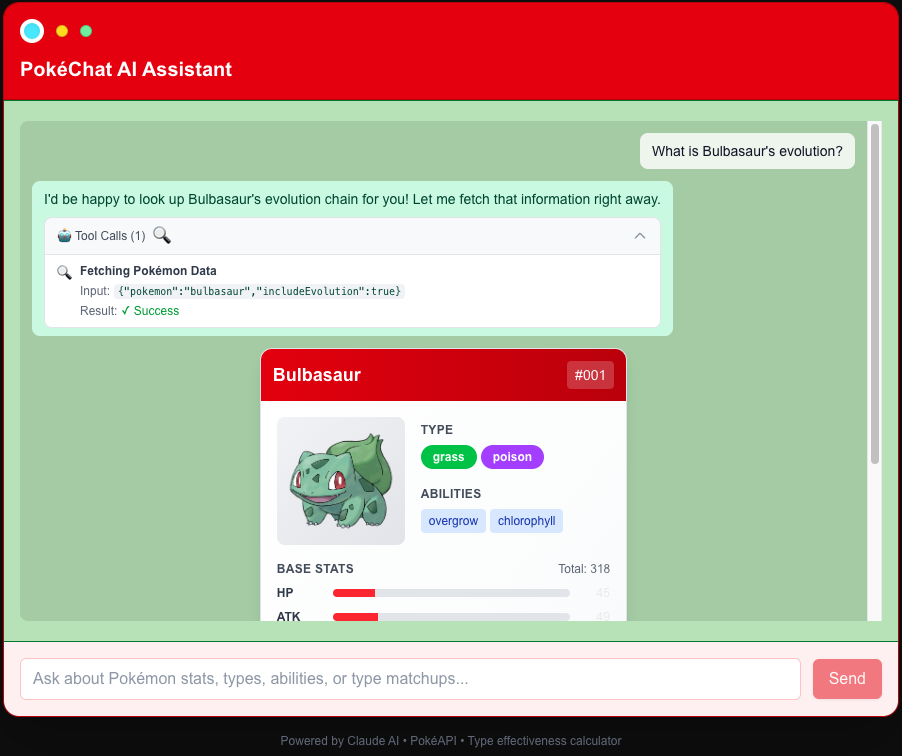
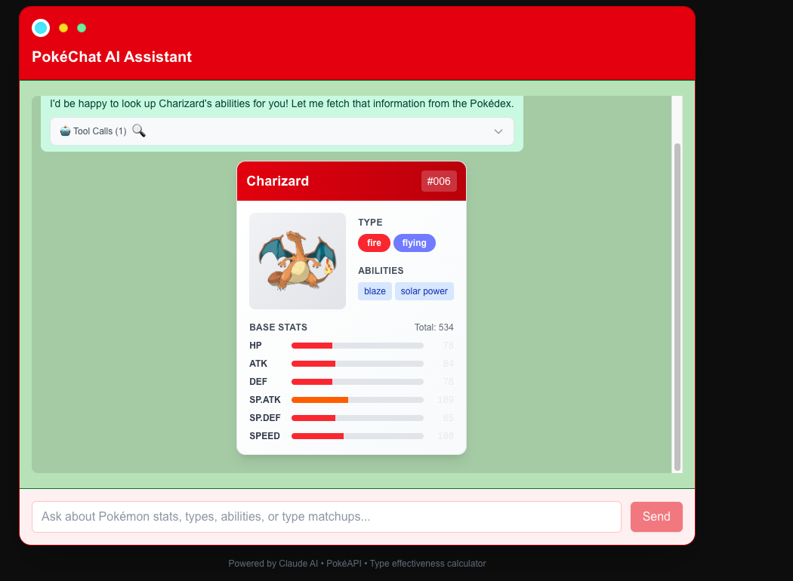

# PokéChat AI Assistant

A real-time streaming AI assistant that combines Claude AI with Pokémon data to create an interactive Pokédex experience. Features advanced streaming architectures, tool integration, and modern web development practices.

## Features

- **Real-time Streaming**: Server-Sent Events (SSE) for live AI responses
- **Smart Tools**: PokéAPI integration with type effectiveness calculator
- **Rich Data Cards**: Interactive Pokémon stats and type matchup visualizations
- **Pokédex UI**: Authentic Pokédex-inspired interface design
- **Performance**: Smart caching with LRU + TTL for optimal response times
- **Type Safety**: End-to-end TypeScript with Zod validation

## Screenshots

<p align="center">
  
</p>

<p align="center">
  
</p>

<p align="center">
  
</p>

Notes:
- Place PNG files at `./screenshots/chat.png`, `./screenshots/evolution.png`, and `./screenshots/type-effectiveness.png`.
- Filenames and paths are relative so the images render on GitHub and other viewers.

## Quick Start

### Prerequisites

- **Node.js** 18+ or **Bun** runtime
- **Anthropic API Key** (Claude AI)

### Installation

1. **Clone and install dependencies:**
   ```bash
   git clone <repository-url>
   cd pokechat
   bun install
   ```

2. **Set up environment variables:**
   ```bash
   cp env.example .env.local
   ```
   
   Edit `.env.local` and add your Anthropic API key:
   ```env
   ANTHROPIC_API_KEY=sk-ant-your-key-here
   ANTHROPIC_MODEL=claude-3-5-sonnet-20241022
   ```

3. **Run the development server:**
   ```bash
   bun run dev
   ```

4. **Open your browser:**
   Navigate to [http://localhost:3000/chat](http://localhost:3000/chat)

## Usage Examples

Try these sample queries to see PokéChat in action:

- **Pokémon Stats**: "Show me Pikachu's stats and abilities"
- **Type Effectiveness**: "What types are effective against Fire/Flying?"
- **Evolution Chains**: "What is Bulbasaur's evolution line?"
- **Battle Analysis**: "Compare Charizard vs Blastoise stats"

## Project Structure

```
├── app/
│   ├── api/chat/          # Streaming chat endpoint
│   ├── chat/              # Main chat interface
│   └── components/        # Reusable UI components
├── lib/
│   ├── anthropic/         # AI service integration
│   ├── tools/             # PokéAPI and type effectiveness tools
│   └── schemas/           # Zod validation schemas
├── types/                 # TypeScript type definitions
├── data/                  # Static data (type effectiveness chart)
└── tests/                 # Unit tests
```

## API Endpoints

### POST `/api/chat`
Streaming chat endpoint that accepts messages and returns Server-Sent Events.

**Request:**
```json
{
  "messages": [
    { "id": "1", "role": "user", "content": "Show me Pikachu" }
  ]
}
```

**Response:** SSE stream with events:
- `text`: Streaming text deltas
- `tool_call`: Tool execution notifications  
- `tool_result`: Tool execution results
- `done`: Stream completion

### GET `/api/health`
Health check endpoint for monitoring.

## Tools

### PokéAPI Tool (`pokeapi_get_pokemon`)
Fetches normalized Pokémon data with caching.

**Features:**
- Smart caching (5min TTL, 200 entries)
- Data normalization for consistent output
- Optional evolution chain inclusion
- High-quality sprite selection

### Type Effectiveness Tool (`advice_move_recommender`)
Calculates optimal attacking types against opponent types.

**Features:**
- 18×18 type effectiveness matrix
- Multi-type interaction calculations
- Strategic rationale generation
- Configurable result count

## Development

### Running Tests
```bash
bun run test
# or
npx vitest
```

### Type Checking
```bash
bun run type-check
```

### Building for Production
```bash
bun run build
```

### Environment Variables

| Variable | Description | Default |
|----------|-------------|---------|
| `ANTHROPIC_API_KEY` | Claude AI API key | Required |
| `ANTHROPIC_MODEL` | Claude model to use | `claude-3-5-sonnet-20241022` |
| `DEBUG` | Enable debug logging | `false` |

## Architecture Highlights

- **Streaming Architecture**: Custom ReadableStream wrapper for Anthropic API
- **Tool Registry**: Extensible pattern for adding new capabilities  
- **Type Safety**: Comprehensive TypeScript with runtime validation
- **Performance**: LRU caching reduces API calls by ~80%
- **Error Handling**: Graceful degradation with user-friendly messages

## Troubleshooting

### Common Issues

**"ANTHROPIC_API_KEY not set"**
- Ensure `.env.local` exists with valid API key
- Restart development server after adding environment variables

**Streaming stops unexpectedly**
- Check browser console for network errors
- Verify API key has sufficient credits
- Check server logs for detailed error information

**Tool calls fail**
- Verify internet connection for PokéAPI access
- Check if Pokémon names are spelled correctly
- Review server logs for specific error details

### Debug Mode

Enable detailed logging by setting `DEBUG=true` in `.env.local`:

```env
DEBUG=true
```

This provides comprehensive logging for:
- Streaming events and tool executions
- API request/response details
- Caching operations
- Error stack traces